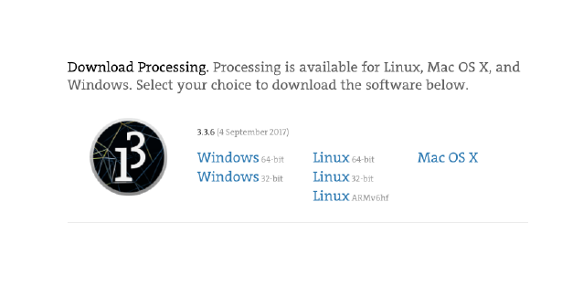
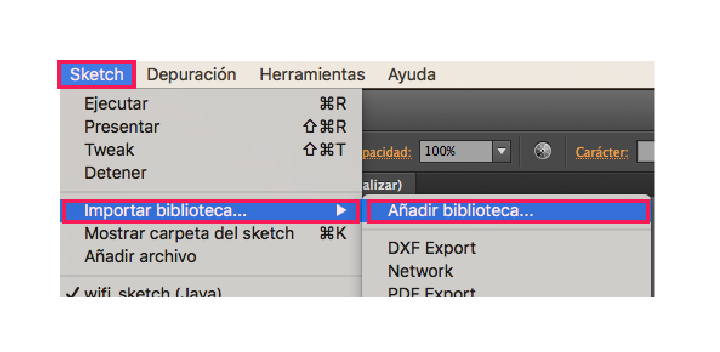
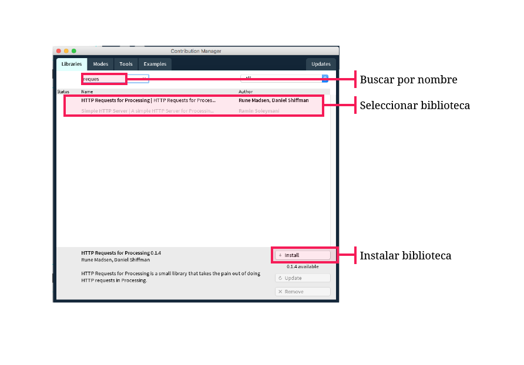
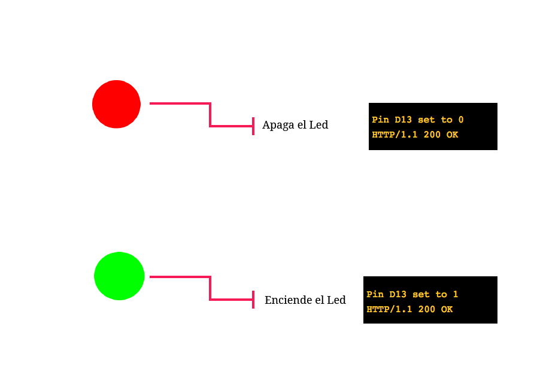

# 3. Controlar placa con Processing

### a. Instalar y abrir [Processing](https://processing.org/download/)



### b. Instalar Biblioteca [HTTP Requests for Processing](https://github.com/runemadsen/HTTP-Requests-for-Processing)

*  Ir a sketch &gt; Importar biblioteca &gt; **Añadir Biblioteca**



*  En la ventana que aparece buscar la biblioteca **HTTP Requests for Processing**



*  Esta biblioteca permite **realizar peticiones** a una url. En este caso se hará una petición llamada GET la cual busca recuperar datos de la url



### c. Escribir un programa que encienda y apague el LED via Wifi al oprimir un botón en la pantalla

*  Este código se puede ver y descargar [acá](https://github.com/disenoMediosInteractivos/Tutoriales/blob/master/03_wifi_setup/wifi_sketch.pde)

```java
//importar biblioteca para hacer http requests
import http.requests.*;

//variable que guarda el estado del botón
boolean prendido = false;

void setup() {

    size(500, 500);
    noStroke();
    fill(255, 0, 0);
}
void draw() {

    background(255);
    //dibujar elipse del botón
    ellipse(width/2, height/2, 150, 150);
}
//función que se activa si el mouse es oprimido
void mousePressed() {
     //revisa que el mouse este tocando el botón
     if (dist(mouseX, mouseY, width/2, height/2) < 150) {
     
         //si el led esta apagado
         if (prendido == false) {
         
            //cambia el color a verde
            fill(0, 255, 0);
           
            //llamar url que prende el LED
            //reemplazar IP del arduino
            GetRequest get = new GetRequest("http://192.168.0.8/arduino/digital/13/1");
            get.send();
           
            //cambia el estado a prendido
            prendido = true;
        
         //si el led esta prendido
         } else {
             //cambia el color a rojo
             fill(255, 0, 0);
            
             //llamar url que apaga el LED
             //reemplazar IP del arduino
             GetRequest get = new GetRequest("http://192.168.0.8/arduino/digital/13/0");
             get.send();
            
            
             //cambia el estado a apagado
             prendido = false;
         }
     }
}
```

 El formato de la url es **http://IPdelarduino/arduino/digital/Pin/**

### d. Correr el programa y hacer clic en la elipse

