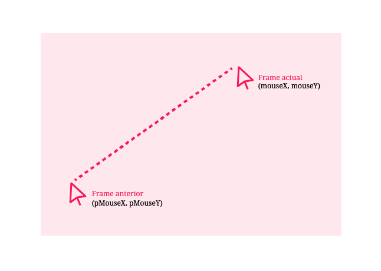
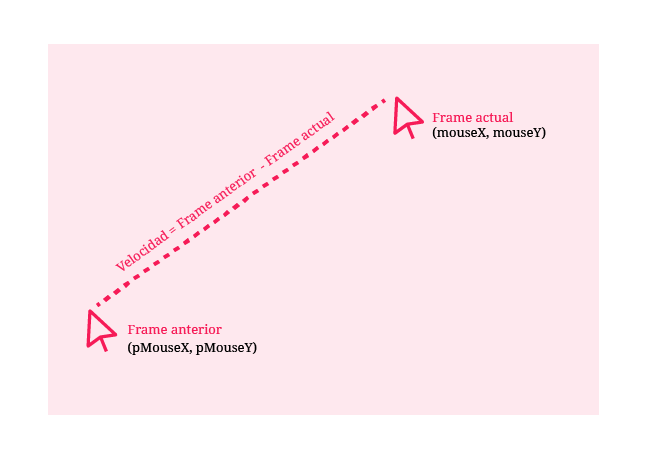
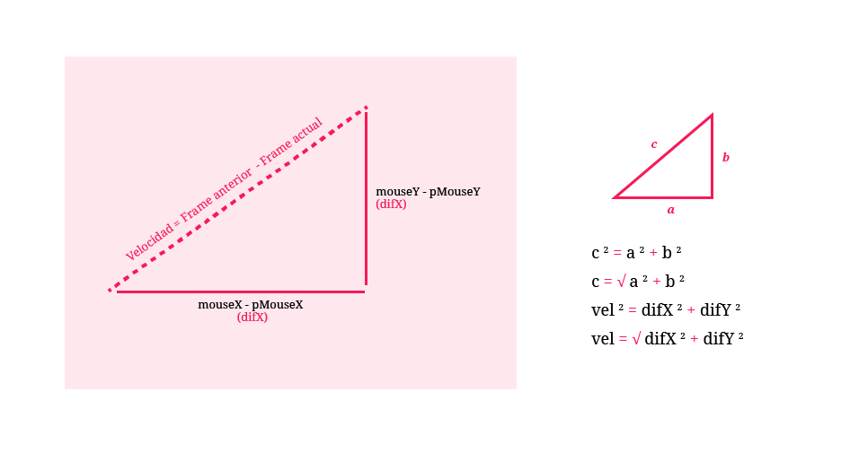

# 2. Velocidad del ratón

¿Cómo conocer la velocidad con la que la persona está moviendo el ratón en la pantalla?

Se puede ver el código de este ejemplo [acá](http://alpha.editor.p5js.org/laurajunco/sketches/H11vmq0Ab)

### a. Conocer la posición actual y la posición anterior del ratón

Para conocer la rapidez con la que se esta moviendo algún objeto, es necesario conocer por lo menos **dos posiciones y compararlas en el tiempo.**

**pMouseX** y **pMouseY** son dos variables de p5.js que siempre guardan la posición en X y Y del ratón del frame anterior al actual.



### b. Calcular la diferencia entre ambas posiciones

La velocidad con la que se esta moviendo el ratón en cada frame se puede calcular al hacer la resta de la posición actual del mouse con la posición que tuvo en el frame inmediatamente anterior.



Utilizando el **teorema de Pitágoras** se puede obtener la velocidad del ratón



### c. Realizar el cálculo en p5.js

```javascript
//difX es la la resta de la posicion x del mouse actual con la posicion del mouse anterior

var difX = abs(mouseX - pmouseX);

//difY es la la resta de la posicion y del mouse actual con la posicion del mouse anterior
var difY = abs(mouseY - pmouseY);

//se elevan las restas al poder de 2

difX = pow(difX, 2);
difY = pow(difY, 2);

//la velocidad es dada por el teorema de pitagoras c = sqrt(a^2 + b^2)

//con floor() se redondea la velocidad a un numero entero
var vel = floor(sqrt(difX + difY));

```

* Se utiliza **abs\(valor\)**  para que el resultado de la resta sea siempre positivo.
* La función **pow\(valor, potencia\)** eleva un número a la potencia elegida.
* **sqrt\(valor\)** devuelve la raíz cuadrada de un número.
* **floor\(valor\)** redondea un número decimal a un número entero.

### d. Mostrar la velocidad del ratón en la pantalla

```javascript
//texto que muestra la velocidad en la pantalla
fill(0);
text(vel, 30, 30);
```

  
La función **text\(\)** recibe tres argumentos: el **texto** a mostrar, su posición en **X** y su posición en **Y**

### e. Utilizar la velocidad del ratón para generar algún comportamiento en el programa

En este caso cada vez que el mouse este oprimido y tenga una velocidad mayor a 80 pixeles por frame se creará un nuevo objeto.

```javascript
//revisa que la velocidad del mouse es mayor a 80 y el mouse este presionado

if (vel > 80 && mouseIsPressed) {

    //crea una nueva bola en la posicion mouseX, mouseY y envía la velocidad como parametro
    
bolas[numBolas] = new bola(mouseX, mouseY, vel);
    
    //aumenta el numero de bolas de la lista
    numBolas++;
}
```

#### Crear función para el objeto que se va a crear

```javascript
//función bola recibe (posicion del mouse en X, posicion del mouse en Y, y la velocidad del ratón)
function bola(px, py, v) {

    //variables de posicion, la bola se crea en la posicion X y Y del mouse que recibe por parametro
 
    this.x = px;
    this.y = py;
    
    //variables de velocidad
//la velocidad de cada bola se determina por la velocidad del mouse
    this.velx = v;
    this.vely = v;
    
}
```

Al definir una función, también se definen los **datos o variables** que necesita para funcionar. En este caso: posición en X y Y del ratón y la velocidad del mismo.

