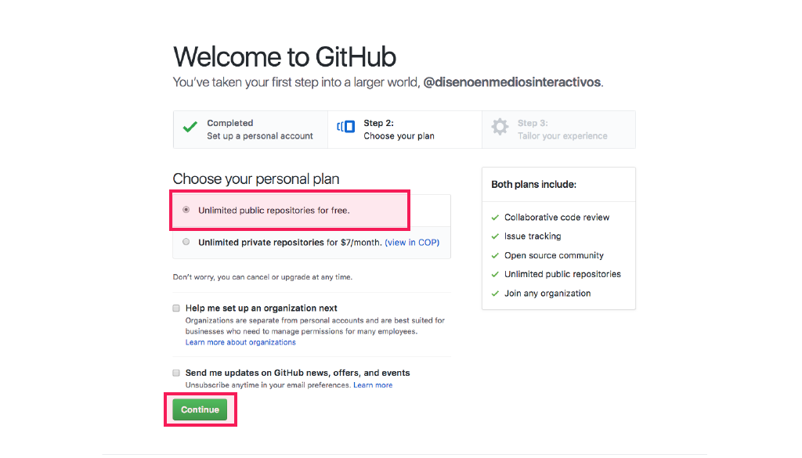
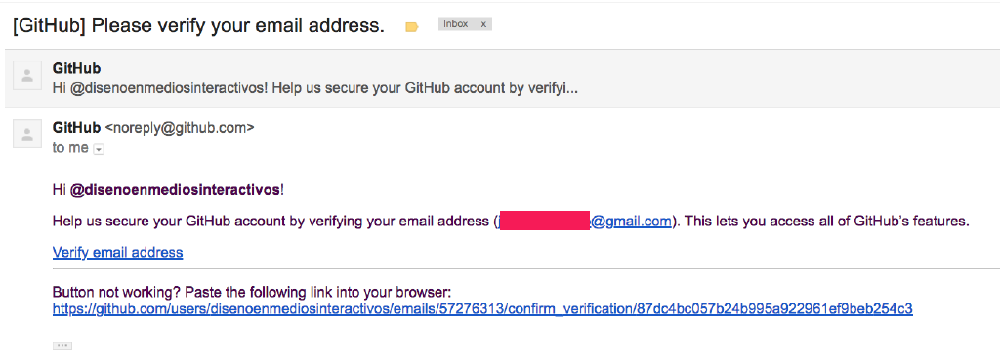
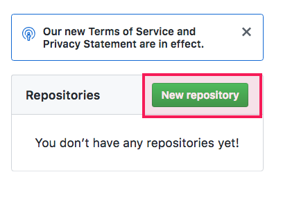

# 2. Crear una cuenta en Github

## ¿Qué es [Github](https://github.com/)?

_Es una plataforma en línea utilizada para desarrollo de software de una manera colaborativa. Es usada por programadores para guardar sus proyectos en internet. En este caso será utilizado para acceder a los ejercicios de p5.js desde la web._

\_\_

Entrar a la página de [Github](https://github.com) y llenar los campos requeridos para crear una cuenta.

Elegir el plan gratuito el cual permite trabajar y crear ilimitadamente repositorios públicos. 

Verificar la dirección de correo electrónico 


Github enviará un link a la dirección de correo electrónico para verificar la cuenta.


## ¿Qué es un repositorio?

_Un_ [_repositorio_](https://help.github.com/articles/about-repositories/) _es un directorio o espacio de **almacenamiento** para algún proyecto. Se pueden guardar todo tipo de archivos en este, pero por lo general se usa para mantener y compartir archivos de código._

\_\_

Hacer click en [Create new repository](https://github.com/new) o en [Start a project](https://github.com/new)

