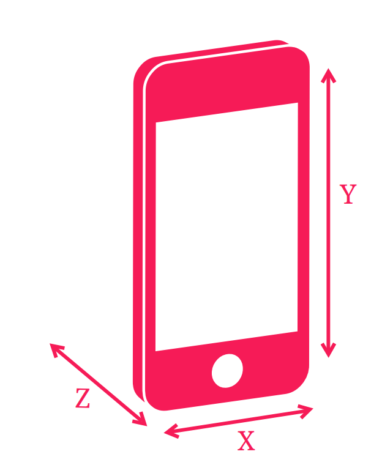

# 2. Rotación

**¿Cómo utilizar la rotación de un dispositivo móvil como elemento de interacción?** Se puede ver el código de este ejemplo [acá](http://alpha.editor.p5js.org/laurajunco/sketches/rkbRR5DyG) y se puede probar [acá](http://alpha.editor.p5js.org/full/rkbRR5DyG)

## ¿Como se detecta la rotación?

La mayoría de dispositivos móviles actuales, tienen un elemento llamado [acelerómetro](https://www.youtube.com/watch?v=KZVgKu6v808). Un acelerómetro es un dispositivo electrónico capaz de medir la **rotación y aceleración** de la pantalla en 3 ejes: X, Y y Z.



En p5.js se pueden encontrar estos datos como 3 **variables**:

* [RotationX](https://p5js.org/reference/#/p5/rotationX): toma valores entre -90 y 90 
* [RotationY](https://p5js.org/reference/#/p5/rotationY): toma valores entre -90 y 90 
* [RotationZ](https://p5js.org/reference/#/p5/rotationZ): toma valores entre 0 y 359

No en todos los dispositivos móviles se puede acceder a los datos de rotación. Para comprobar si es posible en su dispositivo abra [este ejemplo](https://p5js.org/examples/mobile-acceleration-color.html) y si la pantalla cambia de color al agitar el dispositivo significa que funciona.

Ya que la rotación del dispositivo es guardada en variables de p5.js es muy fácil acceder a ella y utilizarla como cualquier otro valor. En este caso, la inclinación del dispositivo se utilizará para mover un objeto en la pantalla.

## a.  Imprimir rotación en el canvas

```javascript
//imprime los valores de rotacion en X y en Y
fill(255);
noStroke();

text("X: " + floor(rotationY), 20, 40);
text("Y: " + floor(rotationX), 20, 20);
```

* En este caso solo se utilizará la rotación en X y en Y del dispositivo.

## b.  Utilizar esas variables para determinar la velocidad de algún objeto

```javascript
//rotationX contola Y
this.vely = map(rotationX, -90, 90, -3, 3);

//rotationY controla X
this.velx = map(rotationY, -90, 50, -3, 3);
```

Con la función [**map\(\)**](https://p5js.org/reference/#/p5/map) se traducen los grados de rotación del dispositivos a valores entre -3 y 3 para la **velocidad del objeto**.

