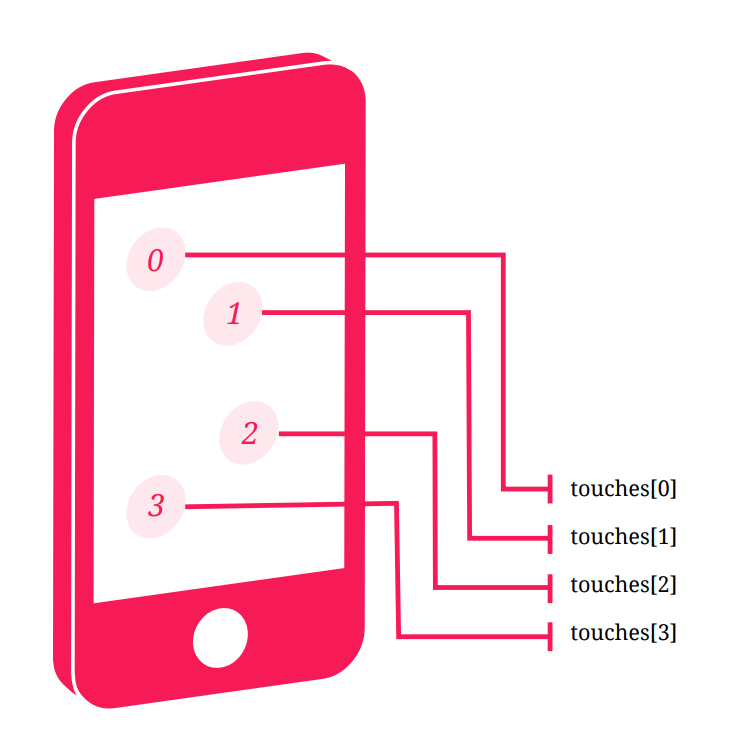

# 3. Toques

**¿Cómo aprovechar la cantidad de toques simultáneos que permite un dispositivo móvil para generar nuevas formas de interacción?** Se puede ver el código de este ejemplo [acá](http://alpha.editor.p5js.org/laurajunco/sketches/Hki-lpvkM) y se puede probar [acá](http://alpha.editor.p5js.org/full/Hki-lpvkM)

### Touches

Dentro de p5.js existe una variable llamada [touches\[\]](https://p5js.org/reference/#/p5/touches). touches\[\] es una **lista** que guarda todos los **puntos de contacto con la pantalla** y sus coordenadas. En este caso de ejemplo la variable touches\[\] tiene 4 elementos:



La forma de acceder a las coordenadas X y Y de un toque es: **touches\[i\].x** y **touches\[i\].y**

Para este ejemplo se realizará una **herramienta de dibujo** de figuras a partir de todos los puntos de contacto que haya con la pantalla en un momento.

## a. Crear una figura con todos los toques de la pantalla

```javascript
//inicia una figura
beginShape();

//recorre todos los puntos en los que se esta tocando la pantalla
for (var i = 0; i < touches.length; i++) {

    //en las coordenadas de cada punto crea un vertice
    vertex(touches[i].x, touches[i].y);

}

//cierra la figura
endShape(CLOSE);
```

Después de iniciar una figura, se **recorren** todos los puntos de contacto con la pantalla y se genera un vértice en las coordenadas de cada uno de ellos. Finalmente se cierra la figura.

## b. Revisar si se oprimió algún botón

```javascript
//recorre todos los puntos en los que se esta tocando la
//pantalla y revisa su distancia con respecto al boton
for (var j = 0; j < touches.length; j++) {

    //revisa si el boton es presionado
    if (dist(touches[j].x, touches[j].y, botx, boty) < 20) {

        //borra la pantalla
        background(0);

   }
}
```

