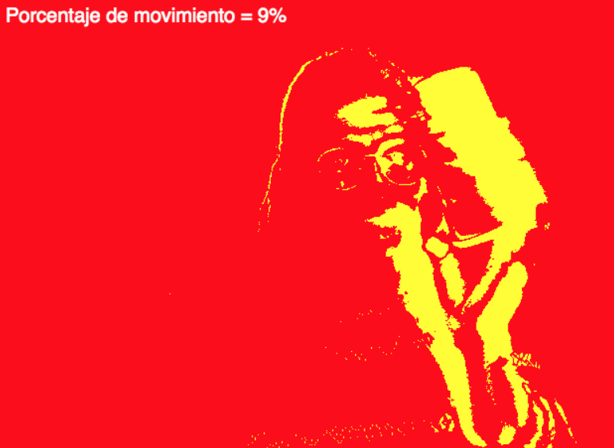

# 2. Detectar movimiento

¿Cómo saber que tanto movimiento hay en un fotograma de video con respecto al anterior? El código de este ejemplo se puede ver [acá ](https://github.com/disenoMediosInteractivos/Ejemplos/blob/master/07_camera/02_motion/sketch.js)y se puede probar [acá](https://disenomediosinteractivos.github.io/Ejemplos/07_camera/02_motion/)

### **a. Guardar los pixeles de la captura**

Para obtener la cantidad de movimiento de un fotograma es necesario guardar los pixeles del fotograma en una variable

* Crear una variable para guardar los pixeles de la captura anterior

```javascript
var pixelesAnteriores; //variable para guardar arreglo de pixeles de la captura
```

* Cargar los pixeles de la pantalla y del canvas

```javascript
capture.loadPixels(); //carga los pixeles de la captura
loadPixels(); //carga los pixeles del canvas
```

* Guardar los pixeles de la captura en la variable **pixelesAnteriores**

```javascript
if(!pixelesAnteriores) {

      //toma los pixeles de la captura y los guarda en una variable
      pixelesAnteriores = capture.pixels;
}
```

Este  código solo se ejecuta _una vez_ debido a que la variable pixelesAnteriores se encuentra vacía al iniciar el sketch

### **b. Recorrer cada pixel de la captura**

* Recorrer las filas y columnas de los pixeles

```javascript
//recorre el arreglo de pixeles
for (var y = 0; y < h; y++) { //recorrer filas
    for (var x = 0; x < w; x++) { //recorrer columnas
    }
}
```

El primer ciclo recorre las **filas** de la pantalla y el **segundo** recorre las columnas

* Obtener indice del pixel actual

```javascript
var i = (x + y * w) * 4; //obtiene el índice del pixel actual
```

Se multiplica por 4 ya que en p5.js los pixeles se guardan de la siguiente manera:

* pixels\[0\] = componente **rojo** del primer pixel
* pixels\[1\] = componente **verde** del primer pixel
* pixels\[2\] = componente **azul** del primer pixel
* pixels\[3\] = componente **alpha** del primer pixel
* pixels\[4\] = componente **rojo** del segundo pixel

Es decir que la información completa de un pixel se encuentra en **4 posiciones** del arreglo pixels.

### c. Comparar los pixeles actuales con los pixeles anteriores

* Crear variables para guardar los pixeles actuales y los anteriores

```javascript
var r, g, b; //variable para guardar color de pixeles
var ar, ag, ab; //variable para guardar color de pixeles anteriores
```

* Obtener valores para cada pixel

```javascript
for (var y = 0; y < h; y++) {
  for (var x = 0; x < w; x++) {
  
    var i = (x + y * w) * 4; //obtiene el índice del pixel actual
  
    r = capture.pixels[i + 0]; //obtiene el valor rojo del pixel
    g = capture.pixels[i + 1]; //obtiene el valor verde del pixel
    b = capture.pixels[i + 2]; //obtiene el valor azul del pixel
  
    ar = pixelesAnteriores[i + 0]; //obtiene el valor rojo del pixel anterior
    ag = pixelesAnteriores[i + 1]; //obtiene el valor verde del pixel anterior
    ab = pixelesAnteriores[i + 2]; //obtiene el valor azul del pixel anterior
  }
}
```

* Obtener promedio de brillo de cada pixel

```javascript
//calcula el brillo promedio de los pixeles
var brillo = (r + g + b) / 3; //actual
var aBrillo = (ar + ag + ab) / 3; //anterior
```

* Pintar los pixeles que cambiaron de un color distinto

```javascript
//si el pixel actual es distinto al anterior
if(abs(aBrillo - brillo) > tol) {

    //pinta el pixel de amarillo
    pixels[i + 0] = 255;
    pixels[i + 1] = 255;
    pixels[i + 2] = 0;
    pixels[i + 3] = 255;
    
} else { //si el pixel no cambio de manera significante

    //lo pinta de rojo
    pixels[i + 0] = 255;
    pixels[i + 1] = 0;
    pixels[i + 2] = 0;
    pixels[i + 3] = 255;
}
```

* Guardar el número de pixeles que cambiaron

```javascript
var total = 0; //crear esta variable afuera del ciclo for
```

* Cada vez que hay un pixel distinto aumentar la variable **total**

```javascript
if(abs(aBrillo - brillo) > tol) {
    total++; //aumenta el total de pixeles que cambiaron
}
```

### e. Actualizar pixeles

* Revisar si algún pixel cambió

```javascript
//solo se actualizan los pixeles si la imagen cambio
//(a veces los frames se repiten)
if (total > 0) {
}
```

* Actualizar los pixeles del canvas

```javascript
if (total > 0) {
    updatePixels(); //actualiza los pixeles del canvas
}
```

* Finalmente, reemplazar los pixeles de la captura anterior con los pixeles de la captura actual

```javascript
//guarda los pixeles actuales en la variable de pixeles anteriores
pixelesAnteriores = capture.pixels;
```




