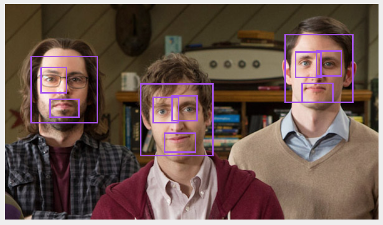

# 4. Detectar caras

¿Cómo detectar objetos de un color especifico en la pantalla? El código de este ejemplo se puede ver [acá](https://editor.p5js.org/laurajunco/sketches/SJvrprAhX).



### a. Incluir librería para detectar caras <a id="a-incluir-libreria-para-detectar-colores"></a>

Para este Ejemplo se utilizará la librería [tracking.js](https://trackingjs.com/) la cual permite detectar colores y rostros en imágenes o videos.

* Descargar la librería de [este enlace](https://github.com/eduardolundgren/tracking.js/archive/master.zip)​
* Agregar los archivos  **tracking.js**  y **face.js** al sketch de p5.js
* Agregar links en el archivo **index.html**

```markup
<script src="tracking.js"> </script>
<script src="face.js"> </script>
```

### b. Mostrar la imagen de captura en la misma posición del canvas <a id="b-mostrar-la-imagen-de-captura-en-la-misma-posicion-del-canvas"></a>

Para la librería es necesario que el elemento de captura exista. Por lo tanto, en este ejemplo no es posible utilizar **capture.hide\(\).** Sin embargo, es posible alinear la captura de la cámara y el canvas en una misma posición

* Crear un elemento contenedor para el video y el canvas en **index.html**.

```markup
<div id="container"></div>
```

El archivo **index.html** debería verse de esta manera:

```markup
<!DOCTYPE html>
<html>
  <head>
    <script src="https://cdnjs.cloudflare.com/ajax/libs/p5.js/0.7.2/p5.min.js"></script>
    <script src="https://cdnjs.cloudflare.com/ajax/libs/p5.js/0.7.2/addons/p5.dom.min.js"></script>
    <script src="https://cdnjs.cloudflare.com/ajax/libs/p5.js/0.7.2/addons/p5.sound.min.js"></script>
		<script src="tracking.js"></script>
    <script src="face.js"></script>
    <link rel="stylesheet" type="text/css" href="style.css">
    <meta charset="utf-8" />
  </head>
  
  <body>
    <div id="container"></div>
    <script src="sketch.js"></script>
  </body>
</html>

```

* Agregar la captura y el canvas al mismo elemento en **setup\(\)**.

```javascript
 //incluye la captura y el canvas dentro del elemento 'container'  
 capture.parent('container');   
 canvas.parent('container'); 
```

* Por último, editar el archivo **style.css** y agregar las siguientes lineas:

```css
#container {    
    position: relative;
}​

canvas, video {  
    width: 100%;  
    height: 100%;  
    position: absolute;  
    top: 0;  
    left: 0;
}
```

Este código modifica los estilos de los elementos de la página para que el video y el canvas queden en **la misma posición** en la pantalla

### c. Inicializar el tracking  <a id="c-inicializar-el-tracking"></a>

* Crear una función donde se realizará la detección de caras y ejecutarla en **setup\(\)**

```javascript
//esta función activa el tracking y encuentra el color seleccionado
function activarTracking() {

}
```

```javascript
function setup() {

    activarTracking();
}
```

* Crear un tracker para detectar caras

Es necesario crear una variable para guardar un objeto de tracking

```javascript
// variable para guardar el tracker de color
var tracker;
```

* Inicializar el objeto como un tracker de caras

```javascript
//crea un tracker de caras
tracker = new tracking.ColorTracker(['face']);
```

* Es necesario especificar el elemento que se analizará, en este caso: la captura de la cámara.

```javascript
//utilizar el tracker de color en la captura de la camara
tracking.track('video', tracker);
```

### d. Detectar caras <a id="d-detectar-color"></a>

Cada vez que el tracker reconoce un grupo de pixeles como una cara **lanza un evento** al cual se puede acceder con la función **tracker.on\( 'track' \).**

```javascript
tracker.on('track', function (event) {​}
```

* Acceder a la información del evento y recorrer la lista de caras encontradas

```javascript
tracker.on('track', function (event) {    

     //recorre la lista de grupos encontrados    
     event.data.forEach(function (r) {
     
     })
});
```

**event.data** es la función que permite acceder a a la información que obtiene el tracker. Este evento retorna una lista de grupos de pixeles. Cada grupo de pixeles\(r\) tiene las siguientes características:

1. **r.x** = posición en x del grupo de pixeles
2. **r.y** = posición en y del grupo de pixeles
3. **r.height** = altura maxima del grupo de pixeles
4. **r.width** = anchura máxima del grupo de pixeles

* Imprimir los datos de cada evento

```javascript
tracker.on('track', function(event) {

    //recorre la lista de grupos encontrados
    event.data.forEach(function(r) {
    
        console.log(r);
    })
});
```

### e. Dibujar un cuadro que enmarque la cara <a id="e-dibujar-con-el-color-seleccionado"></a>

* Crear variables para la posición del cuadro que se dibujará:

```javascript
var x, y; //posicion del rectangulo
var rw, rh; //dimensiones del rectangulo
```

* Utilizar los valores obtenidos del tracking para actualizar la posición del cuadro

```javascript
tracker.on('track', function(event) {

  event.data.forEach(function(r) { //recorre la lista de grupos encontrados

    //actualiza la posicion y tamaño del cuadrado
    x = r.x;
    y = r.y;
    rw = r.width;
    rh = r.height;
    
  })
});
```

* Pintar una cuadro con las coordenadas obtenidas

```javascript
function draw() {
  clear(); //borrar canvas
  
  noFill();
  strokeWeight(2);
  stroke(255, 0, 255);
  
  //dibuja un cuadro en la posición de la cara
  rect(x, y, rw, rh);
}
```

**Clear\(\)** elimina todo el contenido del canvas

