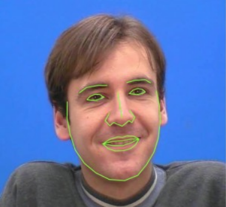
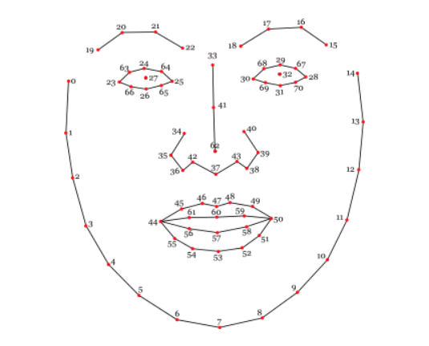

# 5. Detectar expresiones

¿Cómo detectar los puntos específicos de una cara en la pantalla? El código de este ejemplo se puede ver [acá](https://editor.p5js.org/laurajunco/sketches/BykHoKd37).



### a. Incluir librería para detectar caras <a id="a-incluir-libreria-para-detectar-colores"></a>

Para este Ejemplo se utilizará la librería [clmtrackr.js](https://www.auduno.com/clmtrackr/docs/reference.html) la cual permite detectar rostros y sus puntos en p5.js

* Descargar la librería de [este enlace​](https://github.com/auduno/clmtrackr/zipball/dev)
* Agregar los archivos  **clmtrackr.min.js**\(en la carpeta build\)  y **model\_pca\_20\_svm.js**\(en la carpeta models\) al sketch de p5.js
* Agregar links en el archivo **index.html**

```markup
<script src="clmtrackr.min.js"> </script>
<script src="model_pca_20_svm.js"> </script>
```

* **model\_pca\_20\_svm.js** es el archivo modelo visual que se utiliza para reconocer las expresiones faciales



### b. Crear e inicializar tracker

* Crear variable para guardar el tracker

```javascript
var tracker; //variable para guardar el tracker
```

* Inicializar tracker en el setup\(\)

```javascript
  tracker = new clm.tracker(); //inicializa el tracker
  tracker.init(pModel); //inicializa el modelo facial
  tracker.start(capture.elt); //le dice al tracker que busque en la captura de la camara
```

### c. Obtener posiciones de la cara

Cada vez que la librería reconoce una cara devuelve un arreglo con puntos en las posiciones de las partes de la cara

* En el **draw\(\)** guardar las posiciones de los puntos de la cara

```javascript
//guarda las posiciones de los puntos de la cara
  var positions = tracker.getCurrentPosition();
```

**positions** es un arreglo de dos posiciones, es decir que para acceder a las posiciones de las caras se debe hacer de esta manera:

* positions\[ i \]\[ 0 \] = coordenada **x** de la posición i
* positions\[ i \]\[ 1 \] = coordenada **y** de la posición i

### d. Dibujar posiciones de la cara

* Pintar cada punto de la cara

```javascript
//recorre todas las posiciones
for (var i = 0; i < positions.length; i++) {

      fill(255, 0, 0);
      ellipse(positions[i][0], positions[i][1], 4, 4);
      
}
```

* Crear una figura con las posiciones de la cara

```javascript
//recorre el arreglo positions y crea una figura con el
  beginShape();
  
  for (var i = 0; i < positions.length; i++) {
      vertex(positions[i][0], positions[i][1]);
  }
  
  endShape();
```


