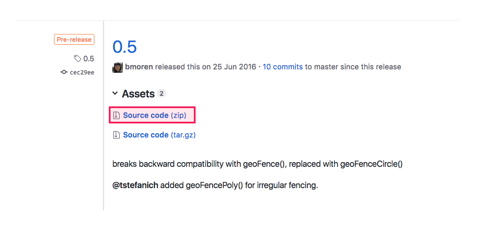
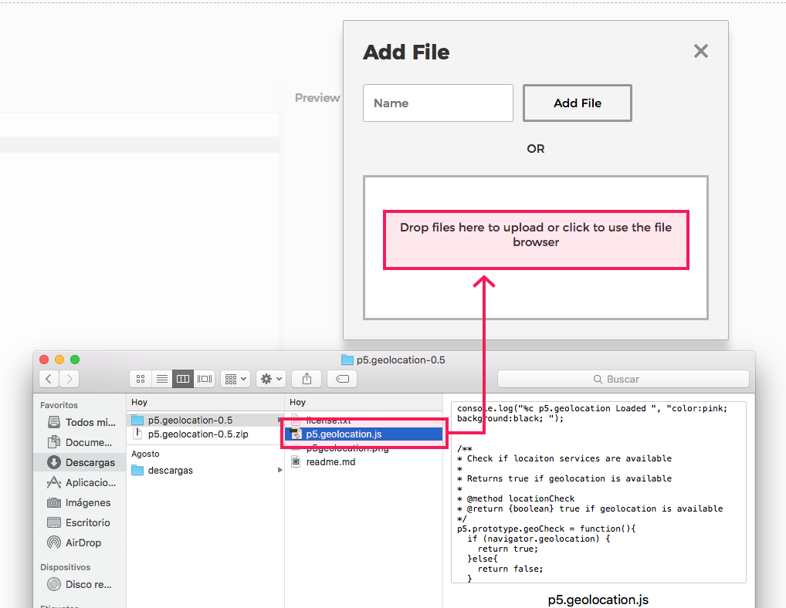

# 1. Configuración

### a. Descargar la libreria p5.geolocation.js

* Descargar la librería p5.js de [esta página](https://github.com/bmoren/p5.geolocation/releases)



* Descomprimir la carpeta


### b. Agregar librería al sketch de p5.js

* Ir a la carpeta de archivos del sketch y hacer clic en **Add File**


* Arrastrar a la pantalla el archivo **p5.geolocation.js**



* Agregar link a la libreria en **index.html**

```markup
<script src="p5.geolocation.js"></script>
```

* el archivo index.html debería verse así:

```markup
<!DOCTYPE html>
<html>
  <head>
    <script src="https://cdnjs.cloudflare.com/ajax/libs/p5.js/0.6.1/p5.min.js"></script>
    <script src="https://cdnjs.cloudflare.com/ajax/libs/p5.js/0.6.1/addons/p5.dom.min.js"></script>
    <script src="https://cdnjs.cloudflare.com/ajax/libs/p5.js/0.6.1/addons/p5.sound.min.js"></script>
    <script src="p5.geolocation.js"></script>
    <link rel="stylesheet" type="text/css" href="style.css">
    <meta charset="utf-8" />
  </head>
  <body>
    <script src="sketch.js"></script>
  </body>
</html>
```

### c. Obtener datos de localización del dispositivo

### d. Dibujar los datos en la pantalla


