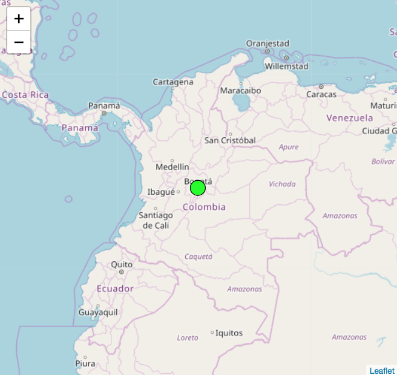

# 3. Mostrar ubicación

En este tutorial se va a mostrar la localización del usuario con un **mapa** en la pantalla.

Se utilizará mappa.js, una librería de javascript que hace sencillo integrar mapas para proyectos basados en geolocalización.

### a. Agregar libreria mappa.js al sketch

* Para agregar esta librería al sketch solo es necesario agregar esta linea al archivo **index.html** dentro de la etiqueta **&lt;head&gt;**

```javascript
<script src="https://unpkg.com/mappa-mundi@0.0.5/dist/mappa.js" type="text/javascript"></script>
```

### b. Crear mapa

* Crear variables para guardar el mapa.

```javascript
var myMap; //variable para guardar el mapa
var mappa; //variable para guardar la plantilla del mapa
```

* Definir las opciones  con las que se dibujará el mapa

```javascript
var options = {
  lat: 0, //latitud de centro del mapa
  lng: 0, //longitud de cetro del mapa
  zoom: 8, //zoom inicial
  //url de donde se toma la imagen del mapa
  style: "https://{s}.tile.osm.org/{z}/{x}/{y}.png" 
}
```

* Para iniciar un mapa se necesitan 3 datos:
  * Latitud y longitud para definir el **centro del mapa**
  * El **zoom inicial** con el que se dibujará el mapa
  * **Url de la imagen** de un mapa


* Inicializar el mapa dentro del **setup\(\)**

```javascript
//crea un map ade leaflet
mappa = new Mappa('Leaflet');
```

**Leaflet** es la plataforma de la cual se toma la plantilla del mapa que se va a utilizar

### c. Obtener datos de localización del usuario

* Crear variables para crear coordenadas

```javascript
var lat; //variable para guardar latitud del usuario
var lng; //variable para guardar longitud del usuario
```

* Obtener localización del usuario

```javascript
//Si geoCheck es true es que es posible medir la posicion del dispositivo
console.log("GeoCheck: " + geoCheck());

//Se llama a la función doThisOnLocation una vez
getCurrentPosition(doThisOnLocation);
```

* Actualizar variables con la posición obtenida

```javascript
function doThisOnLocation(position) {

  //guarda la posicion obtenida en las variables lat y lng
  lat = position.latitude
  lng = position.longitude
}
```

### d. Dibujar mapa

* Actualizar posición inicial del centro del mapa

```javascript
function doThisOnLocation(position) {

  //se acutalizan las opciones del mapa para que el zoom inicial sea en la posicion del usuario
  options.lat = position.latitude
  options.lng = position.longitude
  
  lat = position.latitude
  lng = position.longitude
}
```

* Llamar una función que pinta el mapa

```javascript
function doThisOnLocation(position) {

  options.lat = position.latitude
  options.lng = position.longitude
  lat = position.latitude
  lng = position.longitude

  //llama a la funcion drawMap
  drawMap();
}
```

* Crear función que dibuja el mapa

```javascript
function drawMap() {

  //inicializa el mapa con el objeto options
  myMap = mappa.tileMap(options);

  //pone el mapa en la misma posicion del canvas
  myMap.overlay(canvas);
}
```

### e. Dibujar ubicación del usuario

* Crear función que dibuja un punto en el mapa

```javascript
function drawPoint() {

  //limpia el canvas
  clear();

  //convierte a pixeles la latitud y longitud del dispositivo
  var pos = myMap.latLngToPixel(lat, lng);

  //dibuja una elipse en la posicion del usuario
  fill(0, 255, 0);
  ellipse(pos.x, pos.y, 20, 20);
}
```

* Volver a pintar el punto cada vez que el mapa sea movido o la posición cambia.

```javascript
function drawMap() {

  //inicializa el mapa con el objeto options
  myMap = mappa.tileMap(options);

  //pone en la misma posicion del canvas
  myMap.overlay(canvas);

  //cada vez que se mueva o haga zoom en el mapa se dibuja el punto de posicion
  myMap.onChange(drawPoint);
}
```

La función **myMap.onChange\(\)** es llamada cada vez que **se mueva** el mapa.



