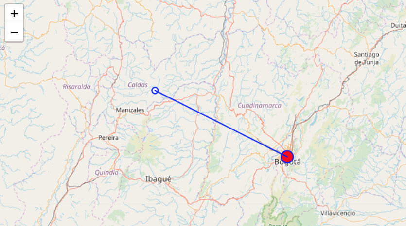
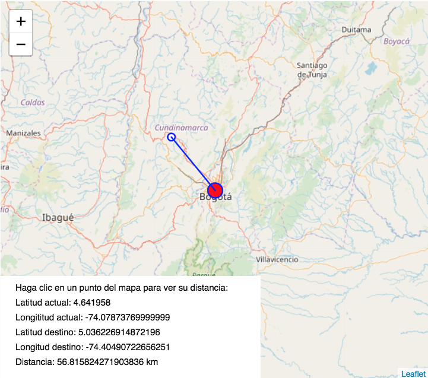

# 4. Visualizar distancias

En este ejemplo se va a mostrar la distancia entre dos puntos del mapa. Se utilizará el ejemplo anterior como punto de partida. El código se puede ver [acá](https://editor.p5js.org/laurajunco/sketches/BkgWGKfsX)​​​.

### a. Crear puntos de destino y localización

* Crear variables de destino, localización y distancia entre ambos

```javascript
var destino; //variable para guardar el destino
var localizacion; //variable para guardar la localizacion actual
var distancia; //variable para guardar distancia
```

En este caso localización y destino son instancias de la clase punto: 

```javascript
function punto(x, y, lat, lng) {
  this.x = x;
  this.y = y;
  this.lat = lat;
  this.lng = lng;

  this.dibujar = function(l) {
    ellipse(this.x, this.y, l, l);
  }

  this.mover = function(x, y, lat, lng) {
    this.x = x;
    this.y = y;
    this.lat = lat;
    this.lng = lng;
  }

  //esta función recibe como parametro un objeto punto
  this.calcDist = function(p) {
    
    //dibuja una linea entre los dos puntos
    line(this.x, this.y, p.x, p.y);
  }
}
```

Cada **punto** tiene unas **coordenadas** así como una **posición** \(x, y\) en la pantalla. Tiene funciones para **dibujarse**, **cambiar su posición** y **calcular su distancia** con respecto a otro punto

* Inicializar puntos en el **setup\(\)**

```javascript
  //inicializa los puntos de localización fuera del canvas
  destino = new punto(-100, -100, -100, -100);
  localizacion = new punto(-100, -100, -100, -100);
```

### b. Seleccionar destino

* Seleccionar un destino cuando se haga clic en la pantalla

```javascript
function mouseClicked() {
  destinoSelec = true;

  //convierte a pixeles la latitud y longitud del destino
  var position = myMap.pixelToLatLng(mouseX, mouseY);

  //mueve el punto a la nueva posicion
  destino.mover(mouseX, mouseY, position.lat, position.lng);

  //llama a la funcion dibujar puntos
  drawPoints();

}
```

* **destino.mover** actualiza la posición del destino con la **posición del mouse**

### c. Pintar destino

* Convertir las coordenadas del destino a **pixeles**

```javascript
//convierte a pixeles la latitud y longitud del destino
var destinoPos = myMap.latLngToPixel(destino.lat, destino.lng);
```

* Llamar a la función **pintar**

```javascript
//dibuja el punto con un ramaño de 10px
destino.dibujar(10);
```

```javascript
//función pintar en punto.js:
this.dibujar = function(tam) {
    ellipse(this.x, this.y, tam, tam);
}
```


* **Actualizar** la posición del destino cada vez que se mueva el mapa

```javascript
//mueve el punto a la nueva posicion
destino.mover(destinoPos.x, destinoPos.y, destino.lat, destino.lng);
```

### d. Dibujar distancia

* Si hay un destino seleccionado se **calcula la distancia** entre localización y destino

```javascript
  //si existe un destino llama a la funcion calcDist()
  if (destinoSelec) {
    localizacion.calcDist(destino);
  }
```

* La función **calcDist\(\)** pinta una linea entre los dos puntos dibujados

```javascript
//esta función recibe como parametro un objeto punto
this.calcDist = function(p) {
       
    //dibuja una linea entre los dos puntos
    line(this.x, this.y, p.x, p.y);
}
```



### e. Dibujar textos con coordenadas en la pantalla

* Crear una función que pinta textos

```javascript
function pintarTexto() {
  //crea un cuadro blanco para pintar los textos
  fill(255);
  noStroke();
  rect(0, height - 140, 350, height);
  fill(0);
  text("Haga clic en un punto del mapa para ver su distancia: ", 20, height - 120);
}
```

* Si hay un destino seleccionado calcular la distancia

```javascript
function pintarTexto() {
  //crea un cuadro blanco para pintar los textos
  fill(255);
  noStroke();
  rect(0, height - 140, 350, height);
  fill(0);
  text("Haga clic en un punto del mapa para ver su distancia: ", 20, height - 120);
  
  //si hay un destino seleccionado
  if (destinoSelec) {

    //calcula la distancia entre el usuario y el destino
    distancia = calcGeoDistance(localizacion.lat, localizacion.lng, destino.lat, destino.lng, 'km')
    }
}
```

* Dibujar coordenadas y distancia

```javascript
function pintarTexto() {

  //crea un cuadro blanco para pintar los textos
  fill(255);
  noStroke();
  rect(0, height - 140, 350, height);
  fill(0);
  text("Haga clic en un punto del mapa para ver su distancia: ", 20, height - 120);

  //si hay un destino seleccionado
  if (destinoSelec) {

    //calcula la distancia entre el usuario y el destino
    distancia = calcGeoDistance(localizacion.lat, localizacion.lng, destino.lat, destino.lng, 'km')

    //pinta en la pantalla los datos de localizacion
    text("Latitud actual: " + localizacion.lat, 20, height - 100);
    text("Longititud actual: " + localizacion.lng, 20, height - 80);
    text("Latitud destino: " + destino.lat, 20, height - 60);
    text("Longitud destino: " + destino.lng, 20, height - 40);
    text("Distancia: " + distancia + " km", 20, height - 20);
  }
}

```



