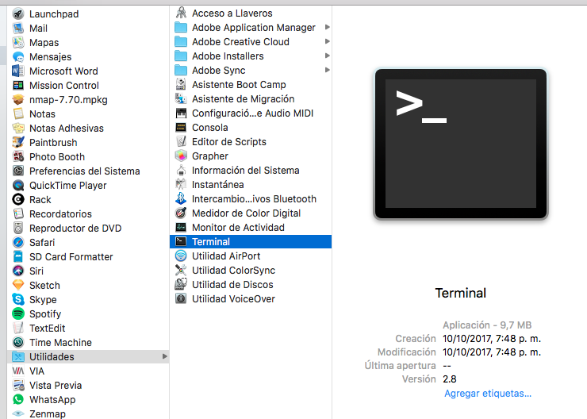

# 1. Configuración

Para este tutorial se trabajará con el ejemplo [00\_base](https://github.com/disenoMediosInteractivos/Ejemplos/tree/master/08_websocket/00_base)

### a. Descargar node.js

Node.js es un entorno de programación que permite desarrollar servidores web en Javascript. Es muy sencillo de usar par alguien que tenga conocimientos básicos en p5.js

* Ir a [la página de node.js](https://nodejs.org/es/) y descargar la aplicación


Abrir el archivo una vez la descarga finalice. Se iniciará un programa para instalar node.js en el equipo.


### b. Descargar repositorio de ejemplos

Para no empezar de cero, existe una carpeta con todos los paquetes y librerías necesarias para iniciar un servidor local.

* Descargar el repositorio de ejemplos en [github](https://github.com/disenoMediosInteractivos/Ejemplos)


* Ir al botón **Clone or Download** y descargar una carpeta .zip con los contenidos del repositorio.


De la carpeta descargada utilizaremos los ejemplos del directorio **08\_websocket**


### c. Ejecutar ejemplo base

* Abrir una ventana de la terminal del equipo. Ir a Aplicaciones &gt; Utilidades &gt; Terminal. También es posible descargar [iTerm](https://www.iterm2.com/)



En la terminal podemos navegar, dar ordenes y ejecutar programas al equipo utilizando texto.

* Navegar a la carpeta 00\_base

Para navegar a una carpeta utilizando la terminal se utiliza el comando cd \(change directory\) seguido de la localización de la carpeta en el equipo.


```bash
cd /Users/usuario/Desktop/Ejemplos/08_websocket/00_base
```

También se puede escribir cd y luego arrastrar la carpeta a la terminal y el _path_ se completará automáticamente.

* Finalmente oprimir _Enter_ para ejecutar el comando.

Para ejecutar el servidor del ejemplo basta con poner en la terminal:

```bash
node server.js
```

Finalmente en  la terminal debe aparecer  **'socket server is running'**


Al ingresar a la ip del equipo en el puerto 3000  en un navegador web \(ejemplo **http://157.253.212.194:3000** o [http://localhost:3000](http://localhost:3000)\) deberíamos ver un canvas completamente rojo.


Si todo esto sale bien usted tiene un servidor de node.js configurado con [Express](https://www.express.com/) y [socket.io](https://socket.io/) y puede hacer programas en los cuales múltiples usuarios se comunican entre si.

### d. Descargar editor de texto

Para editar y trabajar en estos ejemplos se necesitará un **editor de texto**.[ Atom](https://atom.io/) o [Sublime](https://www.sublimetext.com/) son buenas opciones

