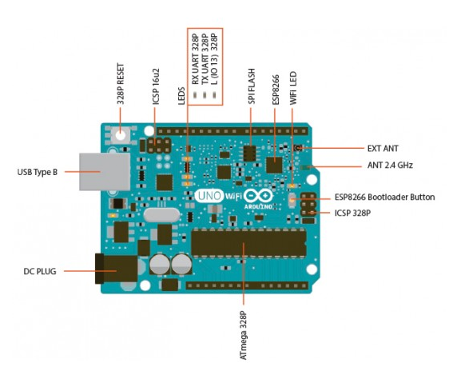
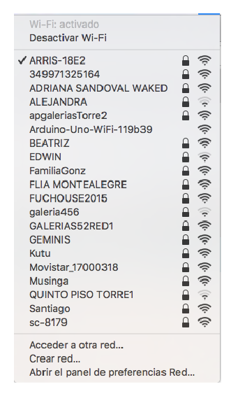
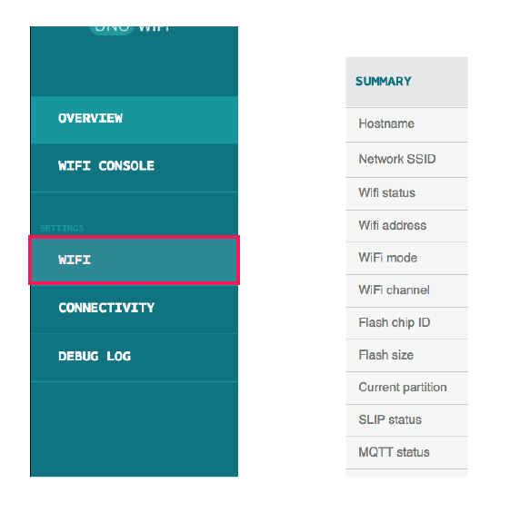
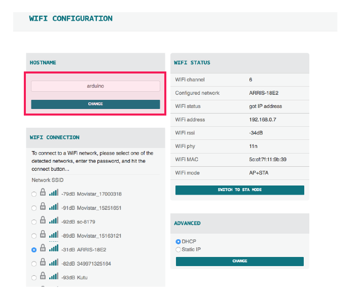
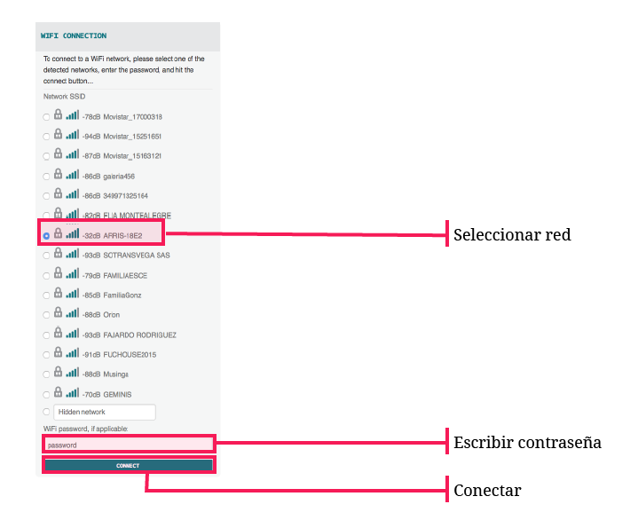
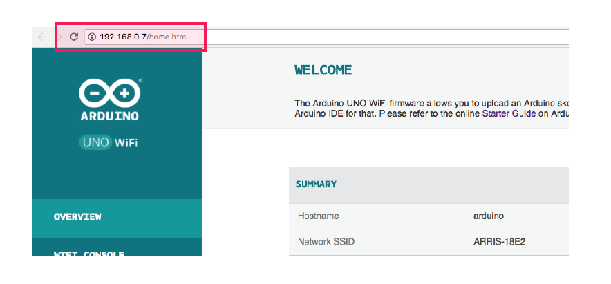
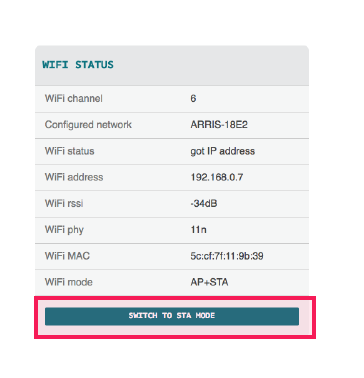

# 1. Configurar Arduino

### a. Conectar la placa con un cable [USB B](https://upload.wikimedia.org/wikipedia/commons/a/a6/USB3_Buchse_Typ_B_IMGP8200_smial_wp.jpg) \(de conectar impresora\) a un computador o a una fuente de poder

### b. Esperar **un minuto** después de que el LED de la placa muestre que está encendida

### c. Ir a la ventana de redes WIFI del computador. 

* Debe aparecer una red con nombre Arduino-Uno-WiFi-xxxxxx. Conectarse a esta red

### d. En un navegador ir a la dirección IP: 192.168.240.1 donde aparece la siguiente interfaz:

*  Esta interfaz nos da acceso al **Firmware** de la placa, el cual permite controlar el arduino sin necesidad de una conexión física con un computador

### e.  Ir a la ventana WIFI de la página

*  En esta página se puede cambiar el **Hostname** del arduino si se desea \(no es necesario\)

*  En la misma ventana conectar a la **red WiFi** a la que se tenga acceso en el momento.

### f.  Después de la conexión aparecerá una pantalla con la **IP** que se le asignó al arduino. Ir a esa dirección

### g.  Esta es la nueva IP del Arduino y desde la cual se trabajará. La dirección puede cambiar cada vez que se conecte a una red WiFi

* Por último, en esta dirección ir a la ventana **WiFi** y cambiar el modo a **STA MODE**

* Es importante cambiar a STA MODE porque así la placa será visible en el Arduino IDE y además, ya no será visible como red abierta para cualquier persona.

