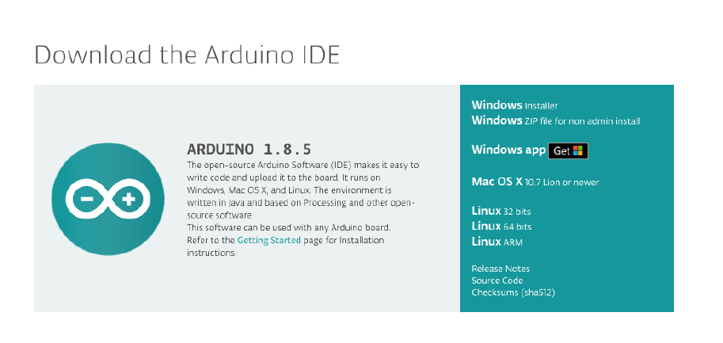
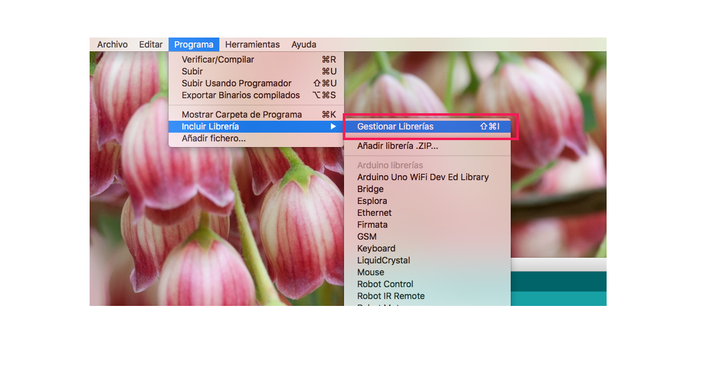
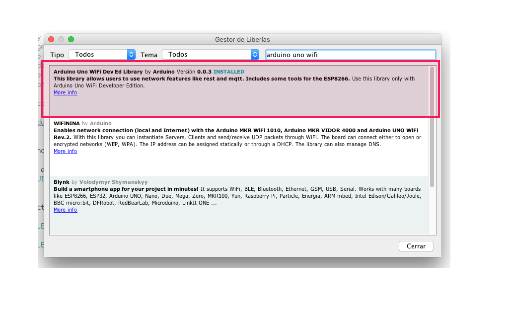
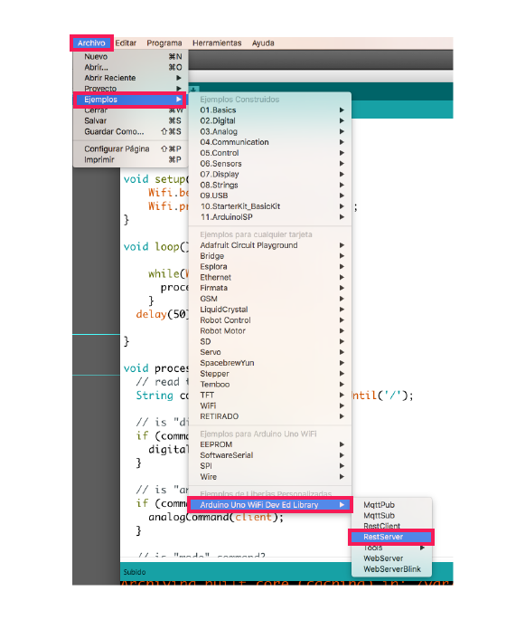
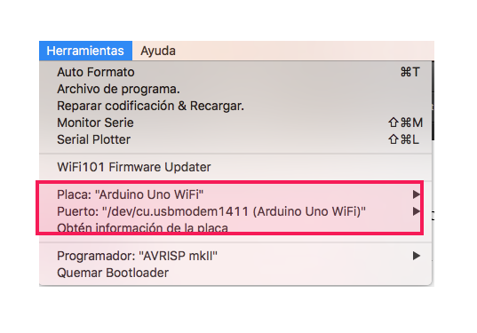
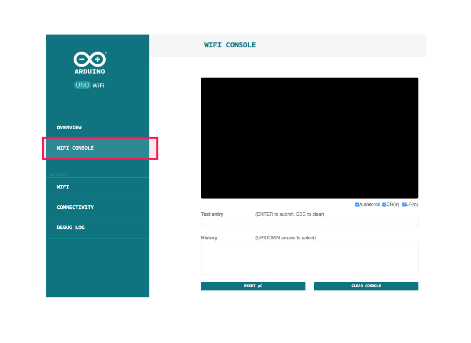
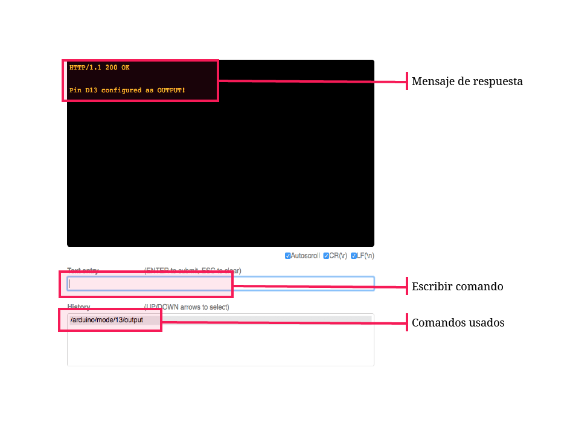
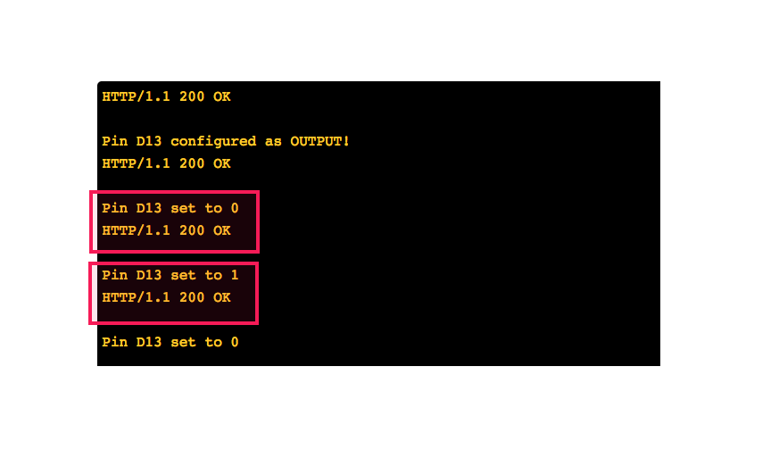

# 2. Configurar Arduino IDE

Después de haber configurado la placa se correrá un programa en Arduino para controlar la placa vía WiFi

### a.  Instalar la última versión del [IDE de Arduino](https://www.arduino.cc/en/Main/Software)

### b. Instalar la librería [Arduino Uno Wifi Dev Ed Library](https://github.com/arduino-libraries/UnoWiFi-Developer-Edition-Lib) 

* Ir a Programa &gt; Incluir Librería &gt; Gestionar Librerías

* En la ventana que aparece buscar la librería **Arduino Uno WiFi Dev Ed Library** e instalarla

### c.  Abrir el ejemplo RestServer 

* Ir a Archivo &gt; Ejemplos &gt; Arduino Uno WiFi Dev Ed Library &gt; RestServer

* Este es un ejemplo de Arduino que permite acceder a los pines de la placa utilizando [REST](https://www.codecademy.com/articles/what-is-rest). 
* **REST** es una forma de comunicación en la cual el servidor esta esperando comandos para **cambiar de estado**

### d.  Asegurarse de que están seleccionados la placa y el puerto correcto

* Después de revisar esto, cargar el programa a la placa

## Controlar un LED de la placa a través de Wifi

### a.  Volver a la interfaz del Firmware en el navegador e ir a WiFi console

### b.  Definir en la consola el LED 13 como un pin de salida con /arduino/mode/13/output

En este programa se pueden utilizar los siguientes comandos:

* **/arduino/digital/13** ----&gt; digitalRead\(13\)
* **/arduino/digital/13/1** ----&gt; digitalWrite\(13, HIGH\)
* **/arduino/analog/2/123** ----&gt; analogWrite\(2, 123\)
* **/arduino/analog/2** ----&gt; analogRead\(2\)
* **/arduino/mode/13/input** ----&gt; pinMode\(13, INPUT\)
* **/arduino/mode/13/output** ----&gt; pinMode\(13, OUTPUT\)

### c.  Escribir en la consola arduino/digital/13/1 para encender el LED. Después arduino/digital/13/0 para apagarlo

